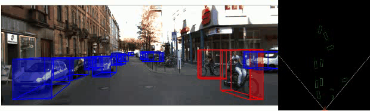

<div align="center">

# YOLO3D: 3D Object Detection with YOLO

<a href="https://www.python.org/"></a>
<a href="https://pytorch.org/get-started/locally/"></a>
<a href="https://pytorchlightning.ai/"></a>

<a href="https://hydra.cc/"></a>
<a href="https://black.readthedocs.io/en/stable/"></a>
<a href="https://github.com/ashleve/lightning-hydra-template"></a><br>

</div>

## ⚠️&nbsp;&nbsp;Cautions
> This repository currently under development

## 📼&nbsp;&nbsp;Demo
<div align="center">



</div>

## 📌&nbsp;&nbsp;Introduction

Unofficial implementation of [Mousavian et al.](https://arxiv.org/abs/1612.00496) in their paper **3D Bounding Box Estimation Using Deep Learning and Geometry**. YOLO3D uses a different approach, as the detector uses **YOLOv5** which previously used Faster-RCNN, and Regressor uses **ResNet18/VGG11** which was previously VGG19.

## 🚀&nbsp;&nbsp;Quickstart
> We use hydra as the config manager; if you are unfamiliar with hydra, you can visit the official website or see the tutorial on this web.

### 🍿&nbsp;&nbsp;Inference
You can use pretrained weight from [Release](https://github.com/ruhyadi/yolo3d-lightning/releases), you can download it using script `get_weights.py`:
```bash
# download pretrained model
python script/get_weights.py \
  --tag v0.1 \
  --dir ./weights
```
Inference with `inference.py`:
```bash
python inference.py \
  source_dir="./data/demo/images" \
  detector.model_path="./weights/detector_yolov5s.pt" \
  regressor_weights="./weights/regressor_resnet18.pt"
```

### ⚔️&nbsp;&nbsp;Training
There are two models that will be trained here: **detector** and **regressor**. For now, the detector model that can be used is only **YOLOv5**, while the regressor model can use all models supported by **Torchvision**.

#### 🧭&nbsp;&nbsp;Training YOLOv5 Detector
The first step is to change the `label_2` format from KITTI to YOLO. You can use the following `src/kitti_to_yolo.py`.

```bash
cd yolo3d-lightning/src
python kitti_to_yolo.py \
  --dataset_path ../data/KITTI/training/
  --classes ["car", "van", "truck", "pedestrian", "cyclist"]
  --img_width 1224
  --img_height 370
```

The next step is to follow the [wiki provided by ultralytics](https://github.com/ultralytics/yolov5/wiki/Train-Custom-Data). **Note:** *readme will updated in future*.

#### 🪀&nbsp;&nbsp;Training Regessor
Selanjutnya, kamu dapat melakukan training model regressor. Model regressor yang dapat dipakai bisa mengacu pada yang tersedia di `torchvision`, atau kamu bisa mengkustomnya sendiri. 

Langkah pertama adalah membuat train dan validation sets. Kamu dapat menggunakan `script/generate_sets.py`:

```bash
cd yolo3d-lightning/script
python generate_sets.py \
  --images_path ../data/KITTI/training/images # or image_2
  --dump_dir ../data/KITTI/training
  --postfix _80
  --train_size 0.8
```

Pada langkah selanjutnya, kita hanya akan menggunakan model yang ada di `torchvision` saja. Langkah termudah adalah dengan mengubah configurasi di `configs.model.regressor.yaml`, seperti di bawah:

```yaml
_target_: src.models.regressor.RegressorModel

net:
  _target_: src.models.components.utils.RegressorNet
  backbone:
    _target_: torchvision.models.resnet18 # edit this
    pretrained: True # maybe this too
  bins: 2

lr: 0.001
momentum: 0.9
w: 0.4
alpha: 0.6
```

Langkah selanjutnya adalah dengan membuat konfigurasi experiment pada `configs/experiment/your_exp.yaml`. Jika bingung, kamu dapat mengacu pada [`configs/experiment/demo.yaml`](./configs/experiment/demo.yaml). 

Setelah konfigurasi experiment dibuat. Kamu dapat dengan mudah menjalankan perintah `train.py`, seperti berikut:

```bash
cd yolo3d-lightning
python train.py \
  experiment=demo
```


## ❤️&nbsp;&nbsp;Acknowledgement

- [YOLOv5 by Ultralytics](https://github.com/ultralytics/yolov5)
- [skhadem/3D-BoundingBox](https://github.com/skhadem/3D-BoundingBox)
- [Mousavian et al.](https://arxiv.org/abs/1612.00496)
```
@misc{mousavian20173d,
      title={3D Bounding Box Estimation Using Deep Learning and Geometry}, 
      author={Arsalan Mousavian and Dragomir Anguelov and John Flynn and Jana Kosecka},
      year={2017},
      eprint={1612.00496},
      archivePrefix={arXiv},
      primaryClass={cs.CV}
}
```